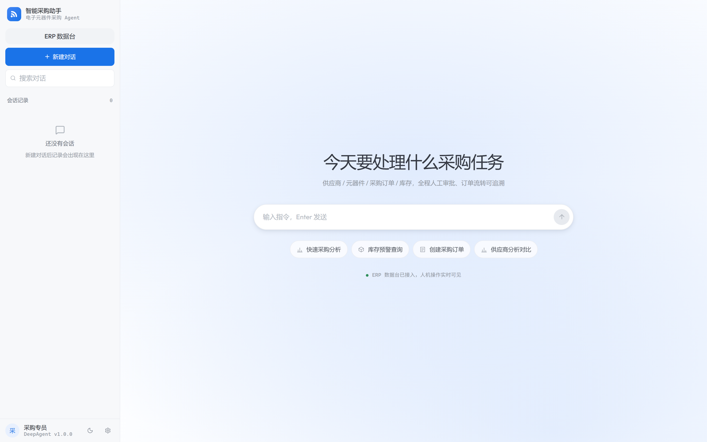
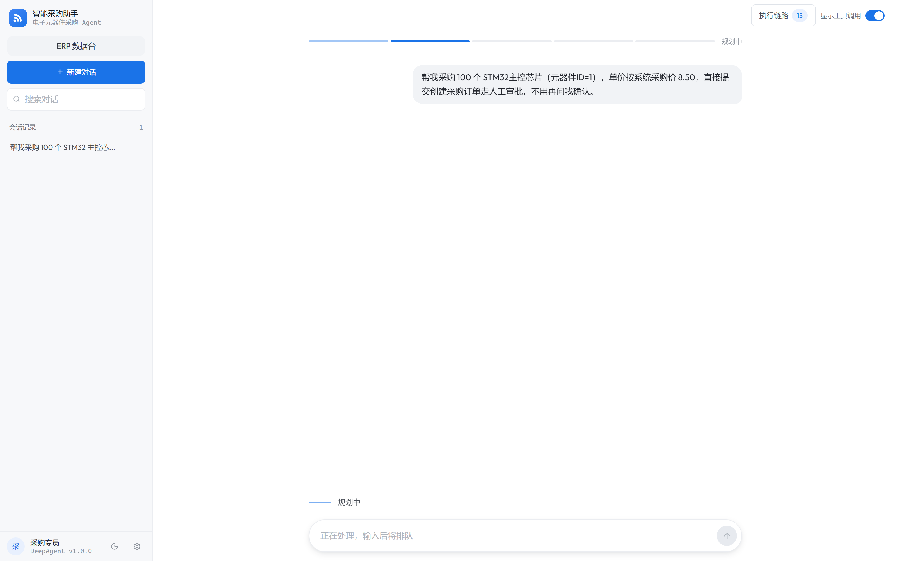
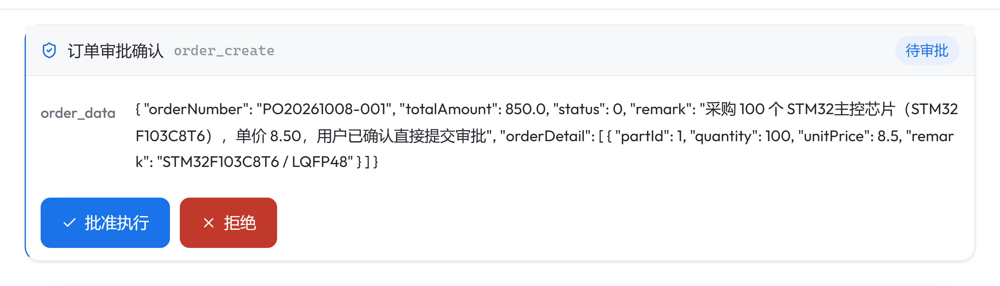
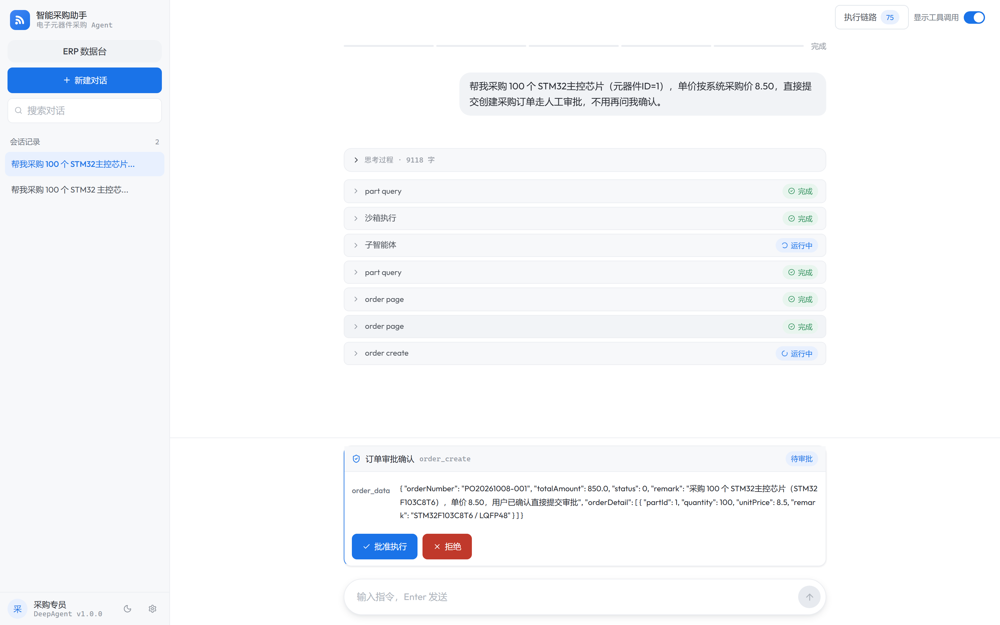
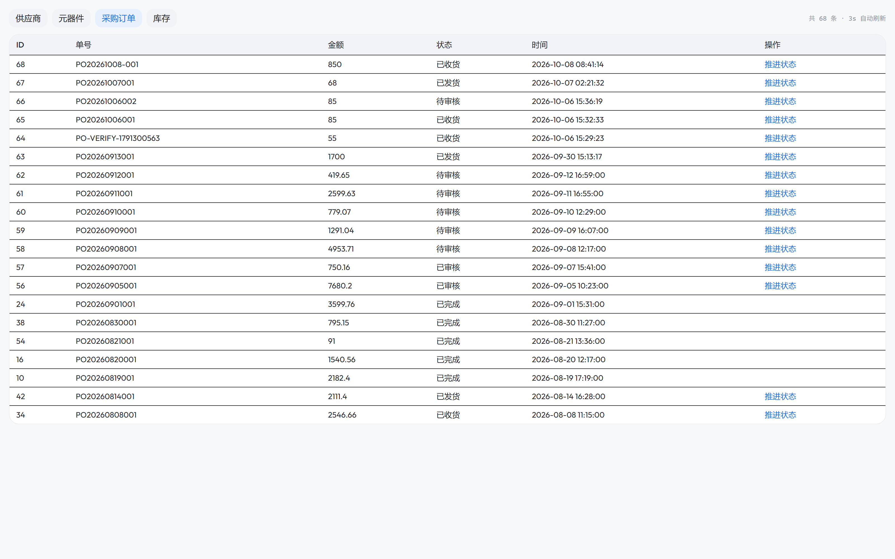
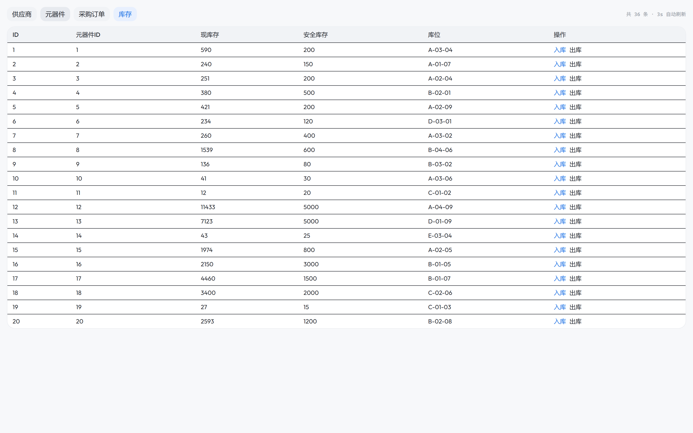
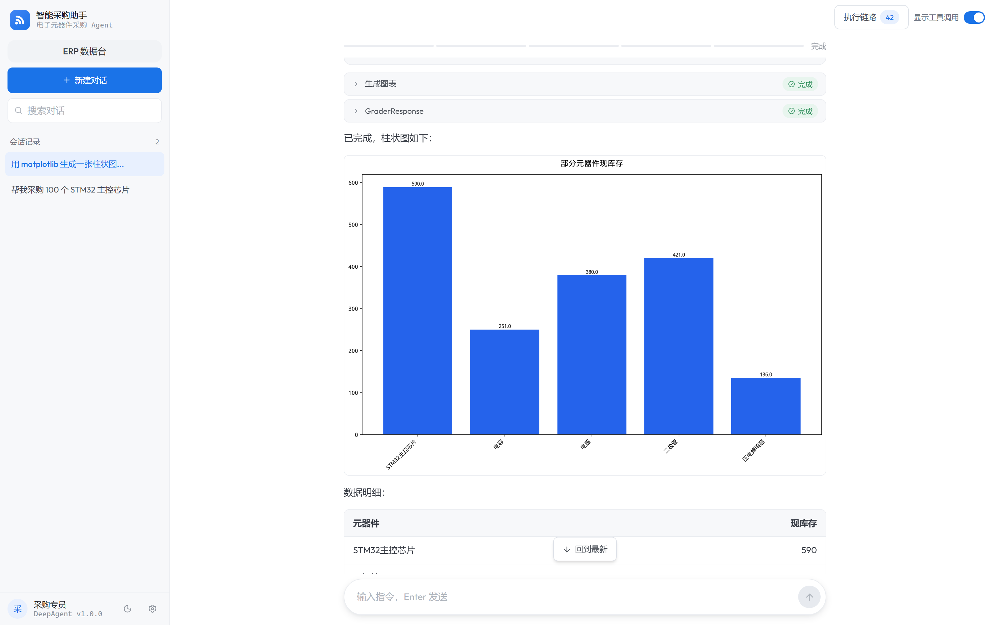
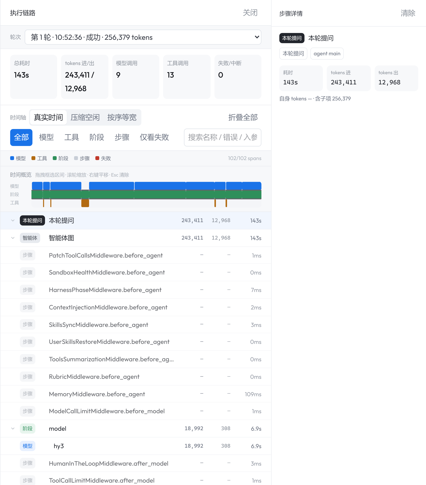
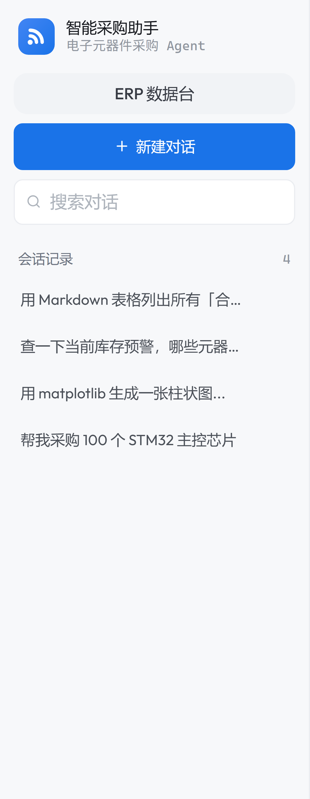

# 知衡（ZhiHeng）— 电子元器件采购智能体

> 基于 LangGraph + DeepAgent 的多智能体采购助手：用自然语言完成「供应商 / 元器件 / 采购订单 / 库存」全流程操作。下单、改单等危险动作强制人工审批（HITL），订单推进到「已收货」时库存自动入库，每一步工具调用都落库成可追溯的执行链路。

---

## 功能预览

### 1. 采购任务对话入口


打开即是采购语境：四张能力卡（快速采购分析 / 库存预警查询 / 创建采购订单 / 供应商分析对比）把高频采购任务一键送到模型，侧边栏的「ERP 数据台」直达人机协同控制台。

### 2. Harness 四阶段工作流（Planning → Executing → Review → Result）


复杂采购任务不再是一段黑盒回答：顶部细线随阶段推进逐格点亮，规划清单与思考链实时展开，让「模型正在干什么」对使用者可见。

### 3. HITL 人工审批（下单前置闸门）


订单创建/修改被硬性拦在审批闸门后：模型提交的完整订单载荷（单号、明细、金额）直接摊在审批卡上，人点「批准执行」才真正落库，避免模型自作主张下单。

### 4. 子 Agent 委派 + 工具调用明细


主 Agent 把「下单」派给采购订单专家、把「分析」派给采购分析专家；每一步 `part_query` / `order page` / `order create`、沙箱执行、子智能体都逐条列出并标注状态，上下文不被原始 DOM/日志污染。

### 5. ERP 数据台：采购订单流转


独立的数据台把 ERP 四张表（供应商 / 元器件 / 采购订单 / 库存）摊平可视；人的手工操作与 Agent 的操作写同一套后端，订单状态流转一眼可查。

### 6. ERP 数据台：收货自动入库（人机协同闭环）


订单推进到「已收货」的同一事务里对明细逐条入库，库存数字自动增加——「人下单 → 审批 → 收货 → 库存变化」形成可验证的闭环，数据台 3s 轮询实时反映。

### 7. 采购分析图表（沙箱内 Matplotlib）


图表由沙箱内的 Matplotlib 渲染（26 种图表类型，镜像自带中文字体、中文标签不乱码），生成物经 `/api/download` 直出到对话——避免「模型只口述数字」的幻觉。

### 8. 全链路执行 Trace


每一轮提问的模型调用、工具调用、中间件步骤全部落库：耗时、token 进/出、调用次数、失败/中断逐项可查，定位「哪一步慢/错」不用翻日志。

### 9. 会话管理


会话按时间倒序沉淀，可搜索、可删除、可跨轮次追溯；刷新/分享都通过 URL 恢复到同一会话。

---

## 项目简介

知衡（ZhiHeng）是一个面向**电子元器件采购管理**的 AI Agent。它接收自然语言指令，自主判断是直接回答还是拆解为多步骤任务，通过 **ERP MCP 工具**操作采购域数据，危险动作走审批，最终给出带数据与图表的结构化结果：

- **供应商管理**：查询/搜索供应商，查看信用评级与合作状态
- **元器件管理**：按分类/供应商筛选元器件，查看价格与规格
- **采购订单全生命周期**：创建（需审批）→ 修改 → 状态流转（待审核 → 已审核 → 已发货 → 已收货 → 已完成）
- **收货自动入库**：订单推进到「已收货」时，对订单明细逐条入库（与状态更新同一事务）
- **库存管理**：库存预警、盘点、入库/出库
- **数据分析与可视化**：采购趋势、供应商对比，生成带图表的分析报告
- **人机协同数据台**：独立前端操作 ERP 四张表，与 Agent 共享同一后端状态

核心能力：

- **Harness 四阶段状态机 + Rubric 评审中间件**：硬校验输出与真实工具数据，不达标自动打回重做，拒绝幻觉
- **HITL 审批闸门**：`order_create` / `order_update` 触发前端审批卡，人到场放行才落库
- **主子 Agent 架构**：采购分析与订单操作分派给专职子 Agent，隔离原始数据噪声，保护主 Agent 上下文
- **自研执行链 Trace**：每次工具调用耗时、token 归因、失败原因落库 `agent_traces`
- **Docker 沙箱执行**：图表/文档在资源受限、无网络的隔离容器内生成
- **MongoDB 全链路持久化**：会话、展示消息、checkpoint、偏好 Store、Trace 全部落库

---

## 技术栈

| 层级 | 技术 | 说明 |
|------|------|------|
| **LLM** | 本地 workbuddy2api-hub 反代网关 | 宿主 `:8788` 反代，`LLM_BASE_URL` 固定 `http://host.docker.internal:8788/v1`，模型由 `LLM_MODEL` 指定（可切换 deepseek / hy / glm 等） |
| **Agent 框架** | DeepAgent + LangGraph | 状态图引擎，支持中断/恢复/子 Agent |
| **MCP 协议** | FastMCP + SSE / streamable-http | ERP-MCP（23 采购工具，`:9000`）；WebIntel-MCP 网页采集（`:9002`，可选） |
| **Web 框架** | FastAPI + Uvicorn | SSE 流式响应 |
| **前端** | Next.js + React + TailwindCSS | 流式对话 UI + 审批交互 + Trace 面板 + ERP 数据台 |
| **数据库** | MongoDB (Motor/Pymongo) | 会话/消息/checkpoint/Store/Trace 持久化 |
| **沙箱** | Docker SDK + 多层安全防护 | 隔离代码执行环境（图表/文档生成） |
| **图表** | Matplotlib + Pandas | 26 种图表类型（折线/柱状/雷达/瀑布…） |
| **语言** | Python 3.11+ / TypeScript | 后端 Python，前端 TypeScript |

---

## 系统架构

```
┌─────────────────────────────────────────────────────────────────────┐
│                    Frontend (Next.js :3000)                          │
│   SSE 流式对话 + HITL 审批卡 + Harness 阶段条 + Trace 面板            │
│   历史管理 + 用户画像编辑器  ║  ERP 数据台 /erp（人机协同）              │
└──────────────────────────────┬──────────────────────────────────────┘
                               │ HTTP / SSE
┌──────────────────────────────▼──────────────────────────────────────┐
│              Backend API (FastAPI :8000)                            │
│   chat.py(SSE 流/中断/恢复) + history.py + profile.py + agent_loader  │
│   MongoDBSaver + MongoDBStore + display_messages + agent_traces      │
└──────────────────────────────┬──────────────────────────────────────┘
                               │
┌──────────────────────────────▼──────────────────────────────────────┐
│              Agent Core (DeepAgent + LangGraph)                      │
│  ┌──────────┐ ┌────────────┐ ┌──────────────────┐ ┌───────────────┐  │
│  │ LLM 网关 │ │ 14 中间件  │ │ procurement-     │ │ procurement-  │  │
│  │ :8788    │ │ Harness/   │ │ analyst          │ │ order         │  │
│  │          │ │ Rubric/HITL│ │ (分析+图表)      │ │ (订单+审批)   │  │
│  └──────────┘ └────────────┘ └──────────────────┘ └───────────────┘  │
│  Tools: ERP MCP(23) + 自定义(14：图表/文档/搜索/下载/信息补充…)         │
└───────────┬─────────────────────────────────────┬───────────────────┘
            │ MCP (SSE)                            │ Docker SDK
┌───────────▼──────────────────┐   ┌──────────────▼───────────────────┐
│  ERP MCP Server (:9000)      │   │  Docker 沙箱 (erp-sandbox)        │
│  supplier / part / order /   │   │  资源限额 + cap 收紧 + tmpfs +    │
│  inventory = 23 tools        │   │  no-new-privileges；自带中文字体  │
└───────────┬──────────────────┘   │  （Matplotlib 图表渲染）          │
            │ HTTP REST            └──────────────────────────────────┘
┌───────────▼──────────────────┐
│  Mock ERP 后端 (:8081)        │
│  FastAPI + SQLite（供应商 16 / 元器件 37 / 订单 / 库存）             │
└──────────────────────────────┘
```

> 采集域（WebIntel-MCP `:9002`）作为可选的浏览器采集能力保留，采购主链路不依赖它：`webintel` 未启动时 backend 自动降级为「仅 ERP 工具」（`src/agent/tools/mcp_client.py`）。

---

## 核心功能

### 1. 采购订单全生命周期 + 收货自动入库

订单状态机严格线性、不可跳级：`0 待审核 → 1 已审核 → 2 已发货 → 3 已收货 → 4 已完成`（`src/mock_erp/db.py` 的 `NEXT_STATUS`）。订单推进到「已收货」时，在**同一事务**里对订单明细逐条入库（`src/mock_erp/main.py` 的 `order_update_status`）——任一明细失败整体回滚，杜绝「状态已收货但库存未过账」。因状态无回退路径，同一订单不可能重复入库。

### 2. HITL 审批闸门

- **UI 层**：`src/agent/config.py` 的 `INTERRUPT_ON_TOOLS` 声明 `order_create` / `order_update`（以及白名单外的浏览器导航），命中即挂起，前端弹出审批卡（`frontend/src/components/interrupt/ApprovalCard.tsx`），展示完整订单载荷供人确认。
- **恢复**：`POST /api/chat/{thread_id}/resume` 携带 `approve/reject` 决策继续执行；并发子 Agent 挂起多个 interrupt 时按 `interrupt_id` 逐一声明。

### 3. 子 Agent 委派（YAML 声明式）

| 子 Agent | 职责 | 工具集 |
|---|---|---|
| procurement-order | 采购订单专家：下单/改单/状态跟踪，信息缺失先向用户询问 | order_* + part_query/search + supplier_query/get + request_order_info |
| procurement-analyst | 采购分析专家：供应商/元器件/库存/订单深度分析 + 出图 | supplier_* + part_* + inventory_* + order_search_details/statistics + generate_chart |

配置见 `src/agent/subagents/configs/*.yaml`（工具集 / 系统提示词 / 委派协议 / `interrupt_on` 全配置化，改流程不改代码）。

### 4. Harness 四阶段 + Rubric 评审

阶段与评审标准抽离到 `src/agent/harness_config.yaml`（DSL）：`planning → executing → reviewing → result`。`HarnessPhaseMiddleware` 驱动阶段流转并向模型注入对应 rubric；`RubricMiddleware` 用独立快模型（`kimi-k2.6`）对结果做结构化判定，未达标打回重做，前端以评审卡展示判定明细。

### 5. Docker 沙箱内的图表/文档生成

所有 `generate_chart` / `generate_document` 调用都在 `erp-sandbox` 容器内执行（`src/agent/backends/`），沙箱带资源上限、cap 收紧、tmpfs 与 `no-new-privileges`；镜像自带中文字体，避免 Matplotlib 中文渲染成方块（`docker/sandbox.Dockerfile`）。生成物提取到 `src/download/`，经 `/api/download/{filename}` 暴露。

### 6. 全链路执行 Trace

`src/agent/trace/` 把每轮提问的模型调用、工具调用、中间件步骤（`kind=llm/tool/node/step`）连同耗时、token 进/出、失败原因落库 `agent_traces`；前端 `TracePanel` 支持真实时间/压缩空闲/按序等宽三种时间轴、类型过滤与搜索。

### 7. 14 层中间件栈

| # | 中间件 | 职责 |
|---|--------|------|
| 1 | SandboxHealthMiddleware | 沙箱健康检查 + 自动重连 |
| 2 | HarnessPhaseMiddleware | 阶段状态机 + rubric 注入 |
| 3 | ContextInjectionMiddleware | 用户上下文注入（工厂模式隔离） |
| 4 | SkillsSyncMiddleware | 技能文件夹级增量同步 |
| 5 | UserSkillsRestoreMiddleware | 用户自定义技能恢复 |
| 6 | ToolsSummarizationMiddleware | 工具调用摘要监控 |
| 7 | MemoryUpdateMiddleware | 用户偏好自动提取 |
| 8 | SandboxCircuitBreakerMiddleware | 沙箱熔断器（三态模型） |
| 9 | BrowserRouteGuardMiddleware | 浏览器路由硬拦截（采集 API 优先落到机制） |
| 10 | ToolDedupMiddleware | 同轮只读工具去重 |
| 11 | StallBreakerMiddleware | 停摆熔断（连续无新信息硬停，防空转烧 token） |
| 12 | RubricMiddleware | 结构化评审 + 打回重做 |
| 13 | ModelCallLimitMiddleware | 模型调用次数上限 |
| 14 | ToolCallLimitMiddleware | 工具调用次数上限 |

---

## 快速启动

### 方式一：Docker 一键启动（推荐）

前置要求：Docker Desktop 已启动；项目根目录存在 `.env` 并填入 `LLM_API_KEY`（本地 workbuddy2api-hub 网关已在宿主 `:8788` 启动）；可从 `.env.example` 复制。

```bash
docker compose build      # 首次构建镜像（后端 Python + 前端 Next + 沙箱）
docker compose up -d      # 启动全部服务
docker compose ps         # 查看状态（mongo/mock-erp/mcp-server 为 healthy）
docker compose logs -f backend   # 跟踪后端日志
docker compose down       # 停止（MongoDB 数据卷保留）
docker compose down -v    # 停止并清空数据
```

浏览器访问 http://localhost:3000 （数据台：http://localhost:3000/erp）。

**只跑采购主链路**（跳过网页采集域，省一个 3.8GB 镜像）：

```bash
docker compose up -d mongo sandbox mock-erp mcp-server backend frontend
```

### 方式二：本地进程手动启动

#### 环境要求

- Python 3.11+（**deepagents 必须 <0.7**，requirements.txt 已锁上界）
- Node.js 18+
- MongoDB 6.0+
- Docker Desktop（已启动）
- 本地 workbuddy2api-hub 网关（宿主 `:8788`）

#### 启动顺序

```
MongoDB → Docker 沙箱 → mock-erp(:8081) → ERP MCP(:9000) → Backend(:8000) → Frontend(:3000)
```

```bash
# 1. MongoDB
docker run -d --name mongodb -p 27017:27017 mongo:6.0

# 2. 沙箱容器（镜像自带中文字体，图表中文渲染依赖它）
docker compose build sandbox
docker run -d --name erp-sandbox -w /workspace myagent-sandbox:local sleep infinity

# 3. Mock ERP（首次启动自动灌入种子数据）
python -m src.mock_erp.main

# 4. ERP MCP Server（:9000）
python -m src.mcp_server.server_main

# 5. 后端 API（:8000）
python -m src.api_view.web_main

# 6. 前端（:3000）
cd frontend && npm run dev
```

> Windows + Git Bash：若 `npm run dev` 报 `'node' 不是内部或外部命令`，改用 `node node_modules/next/dist/bin/next dev`。

---

## 项目结构

```
MyAgent/
├── frontend/                          # Next.js 前端
│   └── src/
│       ├── app/                       # App Router：page.tsx / erp/page.tsx
│       ├── components/
│       │   ├── chat/                  # 对话区（消息/输入/工具调用/阶段条/评审卡）
│       │   ├── interrupt/             # HITL 审批卡 / 信息补充表单
│       │   ├── sidebar/               # 历史/搜索/画像入口
│       │   └── trace/                 # 执行链路 Trace 面板
│       ├── hooks/                     # useChat / useSSE / useHistory
│       └── lib/                       # API / SSE 解析 / erpApi / 类型定义
│
├── src/                               # Python 后端
│   ├── agent/
│   │   ├── main_agent.py              # 主入口：create_main_agent()
│   │   ├── config.py                  # 全局配置 + INTERRUPT_ON_TOOLS
│   │   ├── harness.py                 # Harness 四阶段状态机
│   │   ├── harness_config.yaml        # 阶段/评审标准 DSL
│   │   ├── backends/                  # Docker 沙箱后端
│   │   ├── middlewares/               # 14 个自定义中间件
│   │   ├── tools/                     # 自定义工具（图表/文档/搜索/下载/MCP 客户端）
│   │   ├── trace/                     # 执行链路 Trace 采集/落库
│   │   ├── subagents/                 # 子 Agent（configs/*.yaml 声明式）
│   │   └── memory/                    # 系统提示词与操作手册
│   ├── api_view/                      # FastAPI Web 层（chat/history/profile/download）
│   ├── mcp_server/                    # ERP MCP 网关（23 工具）
│   ├── mock_erp/                      # 本地 Mock ERP（FastAPI+SQLite，契约见 CONTRACT.md）
│   ├── skills/                        # 技能文件
│   └── download/                      # 生成文件下载目录
│
├── docker/                            # Dockerfile（backend/frontend/sandbox）
├── docker-compose.yml                 # 服务编排
├── docs/                              # PRD / 设计拆解 / 实施计划 / 截图
├── .env / .env.example                # 环境变量
└── requirements.txt                   # Python 依赖
```

---

## API 端点

| 方法 | 路径 | 说明 |
|------|------|------|
| POST | `/api/chat/stream` | SSE 流式对话 |
| POST | `/api/chat/{thread_id}/resume` | 中断恢复（审批/补充） |
| GET | `/api/chat/{thread_id}/state` | 获取中断状态 |
| GET | `/api/chat/{thread_id}/history` | 获取消息历史 |
| GET | `/api/chat/{thread_id}/trace/runs` | 会话执行链路 run 列表 |
| GET | `/api/chat/{thread_id}/trace` | 单次 run 的完整链路 |
| GET | `/api/history/{user_id}` | 获取会话列表 |
| DELETE | `/api/history/{thread_id}` | 删除会话 |
| GET/PUT | `/api/profile/{user_id}` | 用户画像读写 |
| GET | `/api/download/{filename}` | 下载沙箱生成文件 |
| GET | `/health` | 健康检查 |

> ERP 数据台经前端 `/erp-api/*` 反代到 mock-erp `/api/*`（`frontend/next.config.ts`），规避 mock-erp 无 CORS 的问题。

---

## 项目亮点

1. **业务闭环可验证**：下单 → 审批 → 发货 → 收货 → 库存自动增加，全链路断言可脚本化复现（人机双前端共享同一后端状态）。
2. **HITL 审批闸门**：`order_create` / `order_update` 硬中断，模型无法绕过人工确认落库。
3. **主子 Agent 架构防上下文污染**：原始查询结果由专职子 Agent 消化提纯，主 Agent 只见纯净 Markdown/JSON。
4. **Harness 状态机 + Rubric 硬校验**：拒绝幻觉，输出无真实工具数据支撑即打回重做。
5. **全链路可视化 Trace**：落库 `agent_traces`，精确追溯每次工具调用耗时、token 进/出与失败原因。
6. **沙箱隔离执行**：图表/文档在限额容器内生成，自带中文字体，宿主机零污染。
7. **失控治理**：停摆熔断、同轮工具去重、模型/工具调用上限，避免 Agent 空转烧 token。
8. **YAML 声明式**：子 Agent 的工具集/提示词/委派协议/中断策略、Harness 阶段与评审标准全配置化。

---

## 开发说明

- 修改 Agent 行为：编辑 `src/agent/memory/prompts.py`（系统提示词）
- 修改评审标准 / 阶段：编辑 `src/agent/harness_config.yaml`
- 添加新工具：在 `src/agent/tools/` 创建，在 `src/agent/main_agent.py` 注册
- 修改子 Agent：编辑 `src/agent/subagents/configs/*.yaml`
- 中断注册：`src/agent/config.py` 的 `INTERRUPT_ON_TOOLS`
- ERP 数据契约：`src/mock_erp/CONTRACT.md`
- 接入真实 ERP：只需修改 `ERP_BASE_URL`，Agent 与 MCP 层零改动
